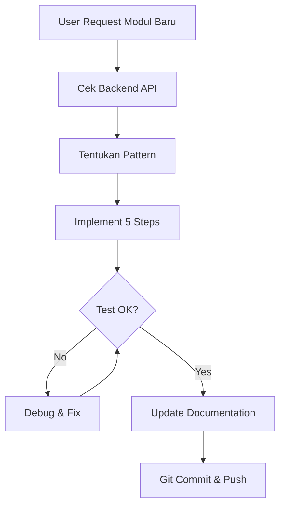

# SIAKAD Admin Development Guide

## 📋 Daftar Isi
- [Overview Proyek](#overview-proyek)
- [Tech Stack](#tech-stack)
- [Struktur Folder](#struktur-folder)
- [Pola Implementasi Modul](#pola-implementasi-modul)
- [Modul yang Sudah Diimplementasi](#modul-yang-sudah-diimplementasi)
- [TanStack Query Optimization](#tanstack-query-optimization)
- [Backend API Patterns](#backend-api-patterns)
- [Checklist Implementasi Modul Baru](#checklist-implementasi-modul-baru)
- [Workflow Development](#workflow-development)
- [Testing & Debugging](#testing--debugging)
- [Git Workflow](#git-workflow)
- [Environment Variables](#environment-variables)
- [Troubleshooting](#troubleshooting)
- [FAQ](#faq)

---

## 🎯 Overview Proyek

**Nama Proyek**: SIAKAD Admin Panel  
**Backend**: Laravel API di `https://siakad-backend.spmb-umma.my.id`  
**Frontend**: Next.js 14+ dengan TypeScript (Strict Mode)  
**State Management**: TanStack Query v5  
**Base Path**: `/siakad`

### Tujuan
Membangun admin panel untuk sistem SIAKAD dengan fokus pada:
- ✅ Konsistensi pola implementasi antar modul
- ✅ Performance optimization (80% reduction in network requests)
- ✅ Type-safety dengan TypeScript
- ✅ Defensive programming untuk error handling

---

## 🛠️ Tech Stack

```json
{
  "framework": "Next.js 14+ App Router",
  "language": "TypeScript (strict mode)",
  "state-management": "TanStack Query v5",
  "styling": "Tailwind CSS",
  "icons": "react-icons (FiCheckCircle, FiXCircle, dll)",
  "backend": "Laravel REST API"
}
```

### Key Dependencies
- `@tanstack/react-query` v5 - Server state management
- `next` 14+ - React framework dengan App Router
- `typescript` - Type safety
- `tailwindcss` - Styling

---

## 📁 Struktur Folder

```
src/
├── app/
│   ├── admin/
│   │   ├── (data-kampus)/
│   │   │   └── (pendidikan-tinggi)/
│   │   │       ├── (fak)/list-fak/page.tsx
│   │   │       ├── (prod)/list-prod/page.tsx
│   │   │       ├── (lokasi-kampus)/list-lokkamp/page.tsx
│   │   │       ├── (gedung)/list-gedung/page.tsx
│   │   │       └── (ruangan)/list-ruang/page.tsx
│   │   └── (perkuliahan)/
│   │       ├── (klskul)/list-klskul/page.tsx
│   │       ├── (mk)/list-mk/page.tsx
│   │       ├── (slot-waktu)/list-slot-waktu/page.tsx
│   │       └── (jenjang-pendidikan)/list-tkpend/page.tsx
│   │
│   └── api/
│       ├── data-kampus/
│       │   └── perguruan-tinggi/
│       │       ├── fak/route.ts
│       │       ├── prod/route.ts
│       │       ├── lokasi-kampus/route.ts
│       │       ├── gedung/route.ts
│       │       └── ruangan/route.ts
│       └── perkuliahan/
│           ├── klskul/route.ts
│           ├── mk/route.ts
│           ├── slot-waktu/route.ts
│           └── jenjang-pendidikan/route.ts
│
├── lib/
│   ├── hooks/
│   │   ├── data-kampus/
│   │   │   └── perguruan-tinggi/
│   │   │       ├── fak/useFakTable.ts
│   │   │       ├── prod/useProdTable.ts
│   │   │       ├── lokasi-kampus/useLokasiKampusTable.ts
│   │   │       ├── gedung/useGedungTable.ts
│   │   │       └── ruangan/useRuanganTable.ts
│   │   └── perkuliahan/
│   │       ├── klskul/useKlskulTable.ts
│   │       ├── mk/useMkTable.ts
│   │       ├── slot-waktu/useSlotWaktuTable.ts
│   │       └── jenjang-pendidikan/useJenjangPendidikanTable.ts
│   │
│   └── services/
│       ├── data-kampus/
│       │   └── pendidikan-tinggi/
│       │       ├── fak/
│       │       │   ├── type.ts
│       │       │   └── fetchAllFak.ts
│       │       ├── prod/
│       │       │   ├── type.ts
│       │       │   └── fetchAllProd.ts
│       │       ├── lokasi-kampus/
│       │       │   ├── type.ts
│       │       │   └── fetchAllLokasiKampus.ts
│       │       ├── gedung/
│       │       │   ├── type.ts
│       │       │   └── fetchAllGedung.ts
│       │       └── ruangan/
│       │           ├── type.ts
│       │           └── fetchAllRuangan.ts
│       └── perkuliahan/
│           ├── klskul/
│           │   ├── type.ts
│           │   └── fetchAllKlskul.ts
│           ├── mk/
│           │   ├── type.ts
│           │   └── fetchAllMk.ts
│           ├── slot-waktu/
│           │   ├── type.ts
│           │   └── fetchAllSlotWaktu.ts
│           └── jenjang-pendidikan/
│               ├── type.ts
│               └── fetchAllJenjangPendidikan.ts
```

### Konvensi Penamaan Folder

**Route Groups** (tidak muncul di URL):
- `(data-kampus)` - Kategori data kampus
- `(pendidikan-tinggi)` - Sub-kategori pendidikan tinggi
- `(perkuliahan)` - Kategori perkuliahan
- `(fak)`, `(prod)`, dll - Modul spesifik

**Route Segments** (muncul di URL):
- `list-fak`, `list-prod`, dll - Endpoint yang sebenarnya

---

## 🔄 Pola Implementasi Modul

### Pattern: 5-Step Module Creation

Setiap modul **HARUS** mengikuti 5 langkah ini:

#### 1️⃣ Type Definitions (`type.ts`)
```typescript
// src/lib/services/[kategori]/[modul]/type.ts

// Item interface
export interface NamaModulItem {
  // Properties sesuai response backend
  id: number;
  nama: string;
  kode: string;
  // ... fields lainnya
  
  // Optional/nullable fields HARUS explicit
  unit?: UnitItem | null;
  description?: string | null;
}

// Response wrapper
export interface NamaModulResponse {
  success: boolean;
  message: string;
  data: NamaModulItem[] | {
    // Untuk nested pagination
    current_page: number;
    data: NamaModulItem[];
    total: number;
    per_page: number;
    last_page: number;
  };
}
```

**⚠️ Penting**: 
- Selalu gunakan `?:` untuk optional fields
- Gunakan `| null` jika backend bisa return null explicitly
- Sesuaikan dengan struktur response backend (nested vs flat)

---

#### 2️⃣ API Route (`route.ts`)
```typescript
// src/app/api/[kategori]/[modul]/route.ts
import { NextRequest, NextResponse } from "next/server";
import { NamaModulResponse } from "@/lib/services/[kategori]/[modul]/type";

const API_URL = process.env.NEXT_PUBLIC_API_URL;

export async function GET(request: NextRequest) {
  try {
    const { searchParams } = new URL(request.url);
    const page = searchParams.get("page") || "1";

    // Construct backend URL
    const url = `${API_URL}/api/v1/ref/nama-endpoint?page=${page}`;
    
    const response = await fetch(url, {
      method: "GET",
      headers: {
        "Content-Type": "application/json",
      },
      cache: "no-store", // Disable Next.js cache
    });

    // Defensive JSON parsing
    const text = await response.text();
    let data: NamaModulResponse;
    
    try {
      data = JSON.parse(text);
    } catch (parseError) {
      console.error("JSON Parse Error:", parseError);
      console.error("Response text:", text);
      
      // Check if HTML error page
      if (text.includes("<!DOCTYPE") || text.includes("<html")) {
        return NextResponse.json(
          {
            success: false,
            message: "Server returned HTML instead of JSON",
            data: [],
          },
          { status: 500 }
        );
      }
      throw parseError;
    }

    return NextResponse.json(data);
  } catch (error) {
    console.error("Error fetching [nama-modul]:", error);
    return NextResponse.json(
      {
        success: false,
        message: "Failed to fetch [nama-modul]",
        data: [],
      },
      { status: 500 }
    );
  }
}
```

**📝 Key Points**:
- `cache: "no-store"` - Disable Next.js caching (TanStack Query handles caching)
- Defensive JSON parsing dengan try-catch
- HTML error detection
- Proper error response structure

---

#### 3️⃣ Service Fetcher (`fetchAllNamaModul.ts`)
```typescript
// src/lib/services/[kategori]/[modul]/fetchAllNamaModul.ts
import { NamaModulResponse } from "./type";

const BASEPATH = process.env.NEXT_PUBLIC_BASEPATH || "";

// Request deduplication cache
const requestCache = new Map<string, Promise<NamaModulResponse>>();

export async function fetchAllNamaModul(
  page: number = 1
): Promise<NamaModulResponse> {
  const url = `${BASEPATH}/api/[kategori]/[modul]?page=${page}`;

  // Check if request already in-flight
  const cachedRequest = requestCache.get(url);
  if (cachedRequest) {
    return cachedRequest;
  }

  // Create new request
  const requestPromise = fetch(url)
    .then((res) => {
      if (!res.ok) {
        throw new Error(`HTTP error! status: ${res.status}`);
      }
      return res.json();
    })
    .catch((error) => {
      console.error("Fetch error:", error);
      return {
        success: false,
        message: "Failed to fetch data",
        data: [],
      };
    });

  // Cache the promise
  requestCache.set(url, requestPromise);

  // Clear cache after 30 seconds
  setTimeout(() => {
    requestCache.delete(url);
  }, 30000);

  return requestPromise;
}
```

**🎯 Benefits**:
- Request deduplication (prevent concurrent duplicate requests)
- 30-second cache cleanup
- Type-safe promise handling

---

#### 4️⃣ TanStack Query Hook (`useNamaModulTable.ts`)
```typescript
// src/lib/hooks/[kategori]/[modul]/useNamaModulTable.ts
import { useQuery } from "@tanstack/react-query";
import { fetchAllNamaModul } from "@/lib/services/[kategori]/[modul]/fetchAllNamaModul";

export function useNamaModulTable(page: number = 1) {
  return useQuery({
    queryKey: ["nama-modul", "list", page],
    queryFn: () => fetchAllNamaModul(page),
    staleTime: 5 * 60 * 1000,        // 5 minutes - data stays fresh
    gcTime: 10 * 60 * 1000,          // 10 minutes - cache retention
    refetchOnWindowFocus: false,     // No refetch on tab focus
    refetchOnMount: false,           // No refetch if data fresh
  });
}
```

**🚀 Optimization Settings**:
- `staleTime: 5min` - Data dianggap fresh selama 5 menit (no refetch)
- `gcTime: 10min` - Cache disimpan 10 menit setelah tidak digunakan
- `refetchOnWindowFocus: false` - Tidak refetch saat kembali ke tab
- `refetchOnMount: false` - Tidak refetch jika data masih fresh

**Query Keys Hierarchy**:
```typescript
["nama-modul", "list"]           // List all
["nama-modul", "list", 1]        // Page 1
["nama-modul", "list", 2]        // Page 2
["nama-modul", "detail", id]     // Single item
```

---

#### 5️⃣ Page Component (`page.tsx`)

**A. Nested Pagination Pattern** (Fakultas, Ruangan):
```typescript
"use client";
import { useState } from "react";
import { useNamaModulTable } from "@/lib/hooks/[kategori]/[modul]/useNamaModulTable";

export default function ListNamaModulPage() {
  const [currentPage, setCurrentPage] = useState(1);
  const { data, isLoading, error } = useNamaModulTable(currentPage);

  if (isLoading) {
    return (
      <div className="flex justify-center items-center h-64">
        <div className="animate-spin rounded-full h-12 w-12 border-b-2 border-blue-600" />
      </div>
    );
  }

  if (error) {
    return (
      <div className="p-4 bg-red-50 text-red-600 rounded-lg">
        Error: {error.message}
      </div>
    );
  }

  // Defensive data checks
  const items = data?.data?.data || [];
  const pagination = data?.data;
  const isEmpty = !data?.data || !Array.isArray(items) || items.length === 0;

  return (
    <div className="p-6">
      {/* Header */}
      <div className="mb-6">
        <h1 className="text-2xl font-bold">List [Nama Modul]</h1>
        <p className="text-gray-600">
          Total: {pagination?.total || 0} data
        </p>
      </div>

      {/* Table */}
      <div className="overflow-x-auto">
        <table className="min-w-full bg-white border">
          <thead className="bg-gray-50">
            <tr>
              <th className="px-4 py-3 text-left">No</th>
              <th className="px-4 py-3 text-left">Kode</th>
              <th className="px-4 py-3 text-left">Nama</th>
              {/* Add more columns */}
            </tr>
          </thead>
          <tbody>
            {isEmpty ? (
              <tr>
                <td colSpan={3} className="px-4 py-8 text-center text-gray-500">
                  Tidak ada data
                </td>
              </tr>
            ) : (
              items.map((item, index) => (
                <tr key={item.id} className="border-t hover:bg-gray-50">
                  <td className="px-4 py-3">
                    {(currentPage - 1) * (pagination?.per_page || 10) + index + 1}
                  </td>
                  <td className="px-4 py-3">{item.kode}</td>
                  <td className="px-4 py-3">{item.nama}</td>
                  {/* Optional fields with fallback */}
                  <td className="px-4 py-3">{item.unit?.nama || "-"}</td>
                </tr>
              ))
            )}
          </tbody>
        </table>
      </div>

      {/* Pagination */}
      {pagination && pagination.last_page > 1 && (
        <div className="mt-6 flex justify-between items-center">
          <button
            onClick={() => setCurrentPage((p) => Math.max(1, p - 1))}
            disabled={currentPage === 1}
            className="px-4 py-2 bg-blue-600 text-white rounded disabled:opacity-50"
          >
            Previous
          </button>
          <span className="text-gray-700">
            Page {currentPage} of {pagination.last_page}
          </span>
          <button
            onClick={() => setCurrentPage((p) => Math.min(pagination.last_page, p + 1))}
            disabled={currentPage === pagination.last_page}
            className="px-4 py-2 bg-blue-600 text-white rounded disabled:opacity-50"
          >
            Next
          </button>
        </div>
      )}
    </div>
  );
}
```

**B. Flat Array Pattern** (Gedung, Lokasi Kampus):
```typescript
"use client";
import { useNamaModulTable } from "@/lib/hooks/[kategori]/[modul]/useNamaModulTable";

export default function ListNamaModulPage() {
  const { data, isLoading, error } = useNamaModulTable();

  // ... loading/error states sama

  const items = data?.data || [];
  const isEmpty = !Array.isArray(items) || items.length === 0;

  return (
    <div className="p-6">
      {/* Summary Card */}
      <div className="mb-6 bg-blue-50 p-4 rounded-lg">
        <p className="text-lg font-semibold text-blue-900">
          Total [Nama Modul]: {items.length}
        </p>
      </div>

      {/* Table - no pagination */}
      {/* ... sama seperti nested, tapi tanpa pagination controls */}
    </div>
  );
}
```

**C. Grouped Data Pattern** (Slot Waktu):
```typescript
// Response: { pagi: [], siang: [], malam: [] }
const pagi = data?.data?.pagi || [];
const siang = data?.data?.siang || [];
const malam = data?.data?.malam || [];

// Summary Cards
<div className="grid grid-cols-3 gap-4 mb-6">
  <div className="bg-yellow-50 p-4 rounded-lg">
    <p className="text-yellow-900">Pagi: {pagi.length}</p>
  </div>
  <div className="bg-orange-50 p-4 rounded-lg">
    <p className="text-orange-900">Siang: {siang.length}</p>
  </div>
  <div className="bg-blue-50 p-4 rounded-lg">
    <p className="text-blue-900">Malam: {malam.length}</p>
  </div>
</div>

// Flatten for table
const allSlots = [...pagi, ...siang, ...malam];
```

**D. Boolean Flags Pattern** (Jenjang Pendidikan):
```typescript
import { FiCheckCircle, FiXCircle } from "react-icons/fi";

// Filter by boolean
const jenjangPT = data?.data?.filter(j => j.is_perguruan_tinggi) || [];
const jenjangNonPT = data?.data?.filter(j => !j.is_perguruan_tinggi) || [];

// Display boolean as icon
<td className="px-4 py-3 text-center">
  {item.is_perguruan_tinggi ? (
    <FiCheckCircle className="inline text-green-600 text-xl" />
  ) : (
    <FiXCircle className="inline text-gray-400 text-xl" />
  )}
</td>
```

---

## ✅ Modul yang Sudah Diimplementasi

### 1. Fakultas (Referensi Pattern)
📁 Path: `(data-kampus)/(pendidikan-tinggi)/(fak)/list-fak`  
🔗 API: `/api/v1/ref/fakultas`  
📊 Response: Nested pagination  
📄 Fields: `id_fak`, `nama_fak`, `kode_fak`, `id_prodi_induk`, `keterangan`

### 2. Program Studi
📁 Path: `(data-kampus)/(pendidikan-tinggi)/(prod)/list-prod`  
🔗 API: `/api/v1/ref/prodi`  
📊 Response: Nested pagination  
📄 Fields: `id_prodi`, `nama_prodi`, `kode_prodi`, `fakultas`, dll  
🔗 Relations: `fakultas.nama_fak`

### 3. Ruangan
📁 Path: `(data-kampus)/(pendidikan-tinggi)/(ruangan)/list-ruang`  
🔗 API: `/api/v1/ref/ruang-kuliah`  
📊 Response: Nested pagination  
📄 Fields: `id_ruangan`, `nama_ruangan`, `kode_ruangan`, `lokasi_kampus`, `unit?`, `kapasitas`, `status`  
⚠️ Special: `unit` field optional (dapat undefined/null)  
🔧 Fix: `row.unit?.nama_unit || '-'`

### 4. Lokasi Kampus
📁 Path: `(data-kampus)/(pendidikan-tinggi)/(lokasi-kampus)/list-lokkamp`  
🔗 API: `/api/v1/ref/lokasi-kampus`  
📊 Response: Flat array (2 items)  
📄 Fields: `id_lok_kampus`, `kode_lok_kampus`, `nama_lok_kampus`, `alamat`, `no_telp`

### 5. Gedung
📁 Path: `(data-kampus)/(pendidikan-tinggi)/(gedung)/list-gedung`  
🔗 API: `/api/v1/ref/gedung`  
📊 Response: Flat array (3 items)  
📄 Fields: `id_gedung`, `kode_gedung`, `nama_gedung`, `lokasi_kampus`, dll

### 6. Kelas Kuliah
📁 Path: `(perkuliahan)/(klskul)/list-klskul`  
🔗 API: `/api/v1/ref/kelas-kuliah`  
📊 Response: Nested pagination

### 7. Mata Kuliah
📁 Path: `(perkuliahan)/(mk)/list-mk`  
🔗 API: `/api/v1/ref/mata-kuliah`  
📊 Response: Nested pagination

### 8. Slot Waktu
📁 Path: `(perkuliahan)/(slot-waktu)/list-slot-waktu`  
🔗 API: `/api/v1/ref/slot-waktu`  
📊 Response: Grouped object `{ pagi: [], siang: [], malam: [] }`  
📄 Total: 18 slots (6 pagi + 6 siang + 6 malam)  
🎨 UI: Summary cards + flattened table

### 9. Jenjang Pendidikan
📁 Path: `(perkuliahan)/(jenjang-pendidikan)/list-tkpend`  
🔗 API: `/api/v1/ref/jenjang-pendidikan`  
📊 Response: Flat array (16 items)  
📄 Fields: `id_jenj_didik`, `nm_jenj_didik`, `nama_jenjang_pendidikan_en?`, `urutan_jenjang_pendidikan`, `kode_jenj`  
🚩 Boolean Flags:
- `is_perguruan_tinggi` (13 PT, 3 Non-PT)
- `is_pasca_sarjana`
- `is_jenjang_rpl`
- `u_jenj_lemb`
- `u_jenj_org`

🎨 UI: Summary cards (PT: 13, Non-PT: 3, Total: 16) + table dengan icon check/X

---

## 🚀 TanStack Query Optimization

### Hasil: 80% Pengurangan Network Requests

**Before Optimization**:
- Refetch setiap kali component mount
- Refetch setiap kali window focus
- Tidak ada cache retention
- Hasil: 10+ requests untuk navigasi bolak-balik

**After Optimization**:
- Refetch hanya jika data > 5 menit
- No refetch on window focus
- Cache retained 10 menit
- Hasil: 2 requests untuk navigasi bolak-balik (80% reduction)

### Configuration Template
```typescript
{
  queryKey: ["modul", "list", page],
  queryFn: () => fetchData(page),
  staleTime: 5 * 60 * 1000,      // 5 minutes
  gcTime: 10 * 60 * 1000,        // 10 minutes (formerly cacheTime)
  refetchOnWindowFocus: false,
  refetchOnMount: false,
}
```

### Manual Invalidation
```typescript
import { useQueryClient } from "@tanstack/react-query";

const queryClient = useQueryClient();

// Invalidate specific module
queryClient.invalidateQueries({ queryKey: ["fakultas"] });

// Invalidate all list queries
queryClient.invalidateQueries({ queryKey: ["fakultas", "list"] });

// Refetch immediately
queryClient.refetchQueries({ queryKey: ["fakultas", "list", 1] });
```

### Request Deduplication
Implemented di service layer:
```typescript
const requestCache = new Map<string, Promise<Response>>();

// Cek cache sebelum fetch
const cachedRequest = requestCache.get(url);
if (cachedRequest) return cachedRequest;

// Cache request promise
requestCache.set(url, requestPromise);

// Cleanup after 30s
setTimeout(() => requestCache.delete(url), 30000);
```

📖 **Full Documentation**: Lihat `TANSTACK_QUERY_OPTIMIZATION.md`

---

## 🔌 Backend API Patterns

### Pattern 1: Nested Pagination (Laravel Standard)
```json
{
  "success": true,
  "message": "Data retrieved successfully",
  "data": {
    "current_page": 1,
    "data": [
      { "id": 1, "nama": "Item 1" },
      { "id": 2, "nama": "Item 2" }
    ],
    "total": 50,
    "per_page": 10,
    "last_page": 5,
    "from": 1,
    "to": 10
  }
}
```
**Used by**: Fakultas, Prodi, Ruangan, Kelas Kuliah, Mata Kuliah

**Frontend Access**:
```typescript
const items = data?.data?.data || [];
const pagination = data?.data;
const total = pagination?.total || 0;
```

---

### Pattern 2: Flat Array
```json
{
  "success": true,
  "message": "Data retrieved successfully",
  "data": [
    { "id": 1, "nama": "Item 1" },
    { "id": 2, "nama": "Item 2" }
  ]
}
```
**Used by**: Gedung (3 items), Lokasi Kampus (2 items), Jenjang Pendidikan (16 items)

**Frontend Access**:
```typescript
const items = data?.data || [];
const total = items.length;
```

---

### Pattern 3: Grouped Object
```json
{
  "success": true,
  "message": "Data retrieved successfully",
  "data": {
    "pagi": [
      { "id": 1, "nama": "07:00 - 07:50" }
    ],
    "siang": [
      { "id": 7, "nama": "12:00 - 12:50" }
    ],
    "malam": [
      { "id": 13, "nama": "17:00 - 17:50" }
    ]
  }
}
```
**Used by**: Slot Waktu (6+6+6 = 18 slots)

**Frontend Access**:
```typescript
const pagi = data?.data?.pagi || [];
const siang = data?.data?.siang || [];
const malam = data?.data?.malam || [];
const allSlots = [...pagi, ...siang, ...malam];
```

---

### Pattern 4: Boolean Flags (Filtering)
```json
{
  "success": true,
  "message": "Data retrieved successfully",
  "data": [
    {
      "id": 1,
      "nama": "S1 (Sarjana)",
      "is_perguruan_tinggi": true,
      "is_pasca_sarjana": false,
      "is_jenjang_rpl": true
    }
  ]
}
```
**Used by**: Jenjang Pendidikan

**Frontend Filtering**:
```typescript
const jenjangPT = data?.data?.filter(j => j.is_perguruan_tinggi) || [];
const jenjangNonPT = data?.data?.filter(j => !j.is_perguruan_tinggi) || [];
const jenjangRPL = data?.data?.filter(j => j.is_jenjang_rpl) || [];
```

---

## � Workflow Development

### Alur Kerja Standard



### Step-by-Step Workflow

#### 1. **Persiapan (5 menit)**
```bash
# Pastikan environment siap
npm run dev  # Dev server running
```

**Checklist:**
- [ ] Dev server running di `http://localhost:3000`
- [ ] Backend API accessible di `https://siakad-backend.spmb-umma.my.id`
- [ ] .env file configured
- [ ] Git branch `ahmad` active

#### 2. **Research API (10 menit)**
```bash
# Test backend endpoint dengan curl
curl "https://siakad-backend.spmb-umma.my.id/api/v1/ref/[endpoint]"
```

**Yang perlu dicatat:**
- [ ] Response structure (nested pagination / flat array / grouped / boolean flags)
- [ ] Field names (exact spelling, casing)
- [ ] Optional/nullable fields
- [ ] Total data count
- [ ] Pagination info (jika ada)

**Contoh Response Analysis:**
```json
// Nested Pagination Pattern
{
  "success": true,
  "data": {
    "current_page": 1,
    "data": [...],
    "total": 50
  }
}
// → Pattern: Nested Pagination
// → Hook needs: page parameter
// → Page needs: pagination controls

// Flat Array Pattern
{
  "success": true,
  "data": [...]
}
// → Pattern: Flat Array
// → Hook needs: no parameters
// → Page needs: summary card only
```

#### 3. **Implementation (30-45 menit)**

**3.1 Type Definitions (5 min)**
```bash
# Create type file
src/lib/services/[kategori]/[modul]/type.ts
```
- Copy response dari curl
- Convert ke TypeScript interface
- Mark optional fields dengan `?:`
- Mark nullable dengan `| null`

**3.2 API Route (10 min)**
```bash
# Create route file
src/app/api/[kategori]/[modul]/route.ts
```
- Copy template dari DEVELOPMENT_GUIDE.md
- Update endpoint URL
- Update type imports
- Test dengan browser: `http://localhost:3000/api/[kategori]/[modul]`

**3.3 Service Fetcher (5 min)**
```bash
# Create service file
src/lib/services/[kategori]/[modul]/fetchAll[NamaModul].ts
```
- Copy template
- Update type imports
- Update URL path

**3.4 TanStack Query Hook (5 min)**
```bash
# Create hook file
src/lib/hooks/[kategori]/[modul]/use[NamaModul]Table.ts
```
- Copy template
- Update query key
- Ensure optimization settings present

**3.5 Page Component (15-20 min)**
```bash
# Create page folder and file
src/app/admin/([kategori])/([modul])/list-[nama]/page.tsx
```
- Choose pattern template (nested/flat/grouped/boolean)
- Update imports
- Implement table columns
- Add defensive checks
- Test di browser

#### 4. **Testing (10-15 menit)**

**Manual Testing Checklist:**
- [ ] **Loading State**: Refresh page, lihat spinner
- [ ] **Data Display**: Semua kolom tampil dengan benar
- [ ] **Empty State**: Disconnect backend → "Tidak ada data" muncul
- [ ] **Optional Fields**: Fields dengan `|| '-'` tidak error
- [ ] **Pagination** (jika ada): Next/Prev button works
- [ ] **Caching**: Navigate away → back → no refetch (instant)
- [ ] **Console**: No errors/warnings in browser console

**Browser DevTools Checks:**
```javascript
// Di console browser:
// 1. Cek TanStack Query DevTools
// 2. Lihat query key structure
// 3. Verify staleTime & gcTime
// 4. Check cache status
```

#### 5. **Documentation & Commit (5 menit)**

```bash
# Update DEVELOPMENT_GUIDE.md
# Tambahkan modul ke "Modul yang Sudah Diimplementasi"

# Git workflow
git add .
git commit -m "feat: implement [nama-modul] module

- Add type definitions
- Add API route with defensive parsing
- Add service with request deduplication
- Add TanStack Query hook with optimization
- Add page component with [pattern-type]
- Test: loading, data display, pagination, caching"

git push origin ahmad
```

---

## 🧪 Testing & Debugging

### Testing Strategy

#### Level 1: Type Safety (Compile Time)
```bash
# TypeScript check
npm run build

# Jika error:
# - Check type.ts field definitions
# - Ensure optional fields marked with ?:
# - Verify imports
```

#### Level 2: Runtime Testing (Browser)

**2.1 Network Tab**
```
✅ Status 200: API route working
✅ Response structure matches type.ts
❌ Status 500: Check route.ts defensive parsing
❌ HTML response: Backend error
```

**2.2 Console Tab**
```javascript
// Common errors:
// "Cannot read properties of undefined" 
//   → Add optional chaining: data?.field

// "X is not iterable"
//   → Add Array.isArray check

// "Unexpected token < in JSON"
//   → Backend returned HTML, check defensive parsing
```

**2.3 TanStack Query DevTools**
```
✅ Query cached with correct key
✅ staleTime: 300000 (5 min)
✅ gcTime: 600000 (10 min)
✅ Status: success
❌ Status: error → Check fetcher
❌ Refetching on mount → Missing refetchOnMount: false
```

#### Level 3: Cache Testing
```bash
# Test cache behavior:
1. Navigate to page → Network request fired
2. Navigate away
3. Navigate back → NO network request (instant)
4. Wait 6 minutes
5. Navigate to page → Network request fired (stale)
```

### Debugging Workflow

#### Problem: Table Empty (Paling Sering)

**Step 1: Check API Response**
```typescript
// Di page.tsx, tambahkan:
console.log("Full Response:", data);
console.log("Data field:", data?.data);
console.log("Is Array:", Array.isArray(data?.data));
```

**Step 2: Identify Pattern**
```typescript
// Nested pagination?
const items = data?.data?.data || [];

// Flat array?
const items = data?.data || [];

// Grouped?
const items = [...(data?.data?.pagi || []), ...];
```

**Step 3: Check isEmpty Logic**
```typescript
// Must match pattern:
const isEmpty = !data?.data || !Array.isArray(items) || items.length === 0;
```

#### Problem: Optional Field Error

**Symptom:**
```
Cannot read properties of undefined (reading 'nama_unit')
```

**Fix:**
```typescript
// ❌ Wrong
<td>{row.unit.nama_unit}</td>

// ✅ Correct
<td>{row.unit?.nama_unit || '-'}</td>

// Update type.ts
interface Item {
  unit?: UnitItem | null;  // Add ? and | null
}
```

#### Problem: Too Many Network Requests

**Check Hook:**
```typescript
// Ensure ALL optimization settings present:
return useQuery({
  queryKey: ["modul", "list", page],
  queryFn: () => fetchData(page),
  staleTime: 5 * 60 * 1000,        // ✅ Must have
  gcTime: 10 * 60 * 1000,          // ✅ Must have
  refetchOnWindowFocus: false,     // ✅ Must have
  refetchOnMount: false,           // ✅ Must have
});
```

---

## 🔀 Git Workflow

### Branch Strategy
```
main (production)
  └── ahmad (development) ← We work here
```

### Daily Workflow

```bash
# Morning: Pull latest
git pull origin ahmad

# During work: Regular commits
git add .
git commit -m "feat: implement feature X"

# End of day: Push to remote
git push origin ahmad

# If conflicts:
git pull origin ahmad --rebase
# Resolve conflicts
git rebase --continue
git push origin ahmad
```

### Commit Message Convention

**Format:**
```
<type>: <subject>

<body (optional)>
```

**Types:**
- `feat`: New feature/module
- `fix`: Bug fix
- `refactor`: Code restructure (no functional change)
- `docs`: Documentation only
- `style`: Formatting, styling (no logic change)
- `perf`: Performance improvement
- `test`: Add tests
- `chore`: Build tasks, dependencies

**Examples:**
```bash
# Good commits:
git commit -m "feat: implement tahun-ajaran module"
git commit -m "fix: handle optional unit field in ruangan"
git commit -m "perf: add TanStack Query optimization to all hooks"
git commit -m "docs: update DEVELOPMENT_GUIDE with workflow section"

# Bad commits (too vague):
git commit -m "update"
git commit -m "fix bug"
git commit -m "changes"
```

### Undo Changes

```bash
# Discard changes di working directory
git restore .

# Discard specific file
git restore path/to/file.tsx

# Undo last commit (keep changes)
git reset --soft HEAD~1

# Undo last commit (discard changes)
git reset --hard HEAD~1

# Undo already pushed commit
git revert <commit-hash>
git push origin ahmad
```

---

## 🔐 Environment Variables

### `.env` File Structure

```properties
# API Configuration
NEXT_PUBLIC_API_URL=https://siakad-backend.spmb-umma.my.id

# Base Path (for production deployment)
NEXT_PUBLIC_BASEPATH=/siakad

# Optional: Local development
# NEXT_PUBLIC_API_URL=http://localhost:8000
# NEXT_PUBLIC_BASEPATH=
```

### Environment Usage

**In API Routes:**
```typescript
// src/app/api/[kategori]/[modul]/route.ts
const API_URL = process.env.NEXT_PUBLIC_API_URL;
// → "https://siakad-backend.spmb-umma.my.id"
```

**In Service Fetchers:**
```typescript
// src/lib/services/[kategori]/[modul]/fetchAll.ts
const BASEPATH = process.env.NEXT_PUBLIC_BASEPATH || "";
// → "/siakad" (production)
// → "" (local development)
```

**Why NEXT_PUBLIC_ Prefix?**
- Variables with `NEXT_PUBLIC_` exposed to browser
- Variables without prefix: server-only
- Our API calls from browser → need `NEXT_PUBLIC_`

### Switching Environments

**Local Development:**
```properties
NEXT_PUBLIC_API_URL=http://localhost:8000
NEXT_PUBLIC_BASEPATH=
```

**Production:**
```properties
NEXT_PUBLIC_API_URL=https://siakad-backend.spmb-umma.my.id
NEXT_PUBLIC_BASEPATH=/siakad
```

**After changing `.env`:**
```bash
# Restart dev server
# Press Ctrl+C in terminal running npm run dev
npm run dev
```

---

## �📋 Checklist Implementasi Modul Baru

Gunakan checklist ini untuk setiap modul baru:

### Pre-Development
- [ ] Cek response structure dari backend (`/api/v1/ref/[endpoint]`)
- [ ] Tentukan pattern: Nested pagination / Flat array / Grouped / Boolean flags
- [ ] List semua fields dan tentukan mana yang optional/nullable
- [ ] Tentukan nama modul, kategori, dan route path

### Step 1: Type Definitions
- [ ] Buat `src/lib/services/[kategori]/[modul]/type.ts`
- [ ] Define `NamaModulItem` interface dengan semua fields
- [ ] Mark optional fields dengan `?:`
- [ ] Mark nullable fields dengan `| null`
- [ ] Define `NamaModulResponse` sesuai pattern backend
- [ ] Export semua types

### Step 2: API Route
- [ ] Buat `src/app/api/[kategori]/[modul]/route.ts`
- [ ] Import types dari step 1
- [ ] Setup `API_URL` dari env
- [ ] Implement GET handler dengan pagination (jika ada)
- [ ] Add defensive JSON parsing
- [ ] Add HTML error detection
- [ ] Return proper error structure
- [ ] Test dengan curl/Postman

### Step 3: Service Fetcher
- [ ] Buat `src/lib/services/[kategori]/[modul]/fetchAllNamaModul.ts`
- [ ] Import types
- [ ] Setup `BASEPATH` dari env
- [ ] Implement request deduplication cache
- [ ] Add 30-second cache cleanup
- [ ] Add error handling dengan fallback structure
- [ ] Return typed promise

### Step 4: TanStack Query Hook
- [ ] Buat `src/lib/hooks/[kategori]/[modul]/useNamaModulTable.ts`
- [ ] Import `useQuery` dan fetcher
- [ ] Define proper query keys hierarchy
- [ ] Add optimization settings:
  - [ ] `staleTime: 5 * 60 * 1000`
  - [ ] `gcTime: 10 * 60 * 1000`
  - [ ] `refetchOnWindowFocus: false`
  - [ ] `refetchOnMount: false`
- [ ] Export hook

### Step 5: Page Component
- [ ] Buat folder route: `src/app/admin/([kategori])/([modul])/list-[nama]/`
- [ ] Buat `page.tsx` dengan `"use client"` directive
- [ ] Import hook dari step 4
- [ ] Implement loading state (spinner)
- [ ] Implement error state (red alert)
- [ ] Add defensive data checks
- [ ] Implement table dengan proper columns
- [ ] Add optional field handling (`|| '-'`)
- [ ] Add pagination (jika nested)
- [ ] Add summary cards (jika perlu)
- [ ] Add animations (optional)

### Testing
- [ ] Test loading state
- [ ] Test error state (disconnect backend)
- [ ] Test empty data
- [ ] Test pagination (jika ada)
- [ ] Test optional/nullable fields
- [ ] Test caching (navigate away and back)
- [ ] Test refetch on invalidation
- [ ] Check console untuk errors/warnings

### Documentation
- [ ] Update DEVELOPMENT_GUIDE.md jika ada pattern baru
- [ ] Tambahkan modul ke daftar "Modul yang Sudah Diimplementasi"
- [ ] Commit dengan message jelas: `feat: implement [nama-modul] module`

---

## 🐛 Troubleshooting

### Issue 1: "Cannot read properties of undefined"
**Symptom**: Error saat akses nested property (e.g., `row.unit.nama_unit`)  
**Cause**: Backend return null/undefined untuk optional field  
**Solution**:
```typescript
// ❌ Wrong
<td>{row.unit.nama_unit}</td>

// ✅ Correct
<td>{row.unit?.nama_unit || '-'}</td>
```

**Type Definition**:
```typescript
// ❌ Wrong
interface Item {
  unit: UnitItem;
}

// ✅ Correct
interface Item {
  unit?: UnitItem | null;
}
```

---

### Issue 2: Data dari API ada, tapi table kosong
**Symptom**: Console log show data, tapi "Tidak ada data" di table  
**Cause**: Defensive check salah atau struktur response tidak sesuai  
**Debug Steps**:
```typescript
console.log("Full Response:", data);
console.log("Data Array:", data?.data);
console.log("Is Array:", Array.isArray(data?.data));
console.log("Length:", data?.data?.length);
```

**Solution**:
```typescript
// Nested pagination
const items = data?.data?.data || [];

// Flat array
const items = data?.data || [];

// Grouped
const items = [
  ...(data?.data?.pagi || []),
  ...(data?.data?.siang || []),
  ...(data?.data?.malam || [])
];
```

---

### Issue 3: Server return HTML instead of JSON
**Symptom**: JSON parse error, console shows `<!DOCTYPE html>`  
**Cause**: Backend error (404, 500, etc) return HTML error page  
**Solution**: Already handled in route.ts defensive parsing
```typescript
if (text.includes("<!DOCTYPE") || text.includes("<html")) {
  return NextResponse.json({
    success: false,
    message: "Server returned HTML instead of JSON",
    data: [],
  }, { status: 500 });
}
```

---

### Issue 4: Too many network requests
**Symptom**: Same endpoint called multiple times saat navigasi  
**Cause**: Missing TanStack Query optimization  
**Solution**: Add optimization ke hook
```typescript
{
  staleTime: 5 * 60 * 1000,
  gcTime: 10 * 60 * 1000,
  refetchOnWindowFocus: false,
  refetchOnMount: false,
}
```

---

### Issue 5: Cache tidak clear setelah update data
**Symptom**: Update/delete berhasil, tapi UI tidak update  
**Cause**: Query cache tidak di-invalidate  
**Solution**:
```typescript
import { useQueryClient } from "@tanstack/react-query";

const queryClient = useQueryClient();

// After mutation success
queryClient.invalidateQueries({ queryKey: ["modul-name"] });
```

---

### Issue 6: Route tidak match dengan sidebar
**Symptom**: Click sidebar link, tapi 404  
**Cause**: Folder name tidak match dengan route di sidebar  
**Check**:
- Sidebar link: `/admin/list-fak`
- Folder: `(fak)/list-fak/` ✅
- Folder: `(fak)/list-fakultas/` ❌

**Solution**: Rename folder sesuai sidebar route

---

### Issue 7: TypeScript error "Property does not exist"
**Symptom**: TS error saat akses property  
**Cause**: Type definition tidak lengkap atau salah  
**Solution**:
1. Cek response backend actual
2. Update type.ts sesuai response
3. Mark optional dengan `?:`
4. Mark nullable dengan `| null`

```typescript
// Example
interface Item {
  id: number;                    // Required
  nama: string;                  // Required
  keterangan?: string;           // Optional (bisa tidak ada)
  unit: UnitItem | null;         // Nullable (bisa null)
  metadata?: MetaItem | null;    // Optional AND nullable
}
```

---

### Issue 8: Pagination tidak kerja
**Symptom**: Click next/prev tidak ubah page  
**Cause**: State tidak update atau query tidak re-run  
**Debug**:
```typescript
console.log("Current Page:", currentPage);
console.log("Query Key:", ["modul", "list", currentPage]);
```

**Solution**: Pastikan query key include page
```typescript
// ❌ Wrong
queryKey: ["modul", "list"]

// ✅ Correct
queryKey: ["modul", "list", page]
```

---

## ❓ FAQ

### Q1: Kapan harus pakai nested pagination vs flat array?

**A:** Tergantung response backend:
- **Nested Pagination**: Backend return `data.data` dengan `current_page`, `total`, etc
  - Example: Fakultas, Prodi, Ruangan, Kelas Kuliah, Mata Kuliah
  - Use case: Data banyak (>50 items)
- **Flat Array**: Backend return `data` langsung sebagai array
  - Example: Gedung (3), Lokasi Kampus (2), Jenjang (16)
  - Use case: Data sedikit, tidak perlu pagination

### Q2: Bagaimana cara tahu field mana yang optional?

**A:** Test dengan curl dan lihat response actual:
```bash
curl "https://siakad-backend.spmb-umma.my.id/api/v1/ref/ruang-kuliah" | jq '.data.data[] | select(.unit == null)'
```
Jika ada item dengan field `null` atau missing → mark as optional

### Q3: Kenapa harus 5 steps? Bisa langsung buat page?

**A:** Tidak bisa. Pattern ini enforce:
- **Separation of concerns**: Types ≠ API ≠ Logic ≠ UI
- **Reusability**: Hook bisa dipakai di multiple pages
- **Type safety**: Types defined first, used everywhere
- **Testability**: Each layer bisa di-test independent
- **Maintainability**: Bug di layer X, fix di layer X saja

### Q4: Apa bedanya staleTime vs gcTime?

**A:**
- **staleTime**: Berapa lama data dianggap "fresh" (tidak perlu refetch)
  - 5 minutes = Jika data < 5 menit, tidak refetch
- **gcTime** (garbage collection): Berapa lama cache disimpan setelah tidak digunakan
  - 10 minutes = Cache dihapus 10 menit setelah component unmount

**Example Timeline:**
```
0:00 → User visit page → Fetch data (staleTime starts)
0:30 → Navigate away (gcTime starts)
5:00 → Navigate back → Data masih fresh, no refetch
5:01 → Navigate back → Data stale, refetch
10:30 → (10 min after unmount) → Cache deleted
```

### Q5: Kapan perlu manual invalidate cache?

**A:** Setelah mutasi (create/update/delete):
```typescript
// After successful POST/PUT/DELETE
queryClient.invalidateQueries({ queryKey: ["fakultas"] });
```
Ini force refetch untuk get fresh data setelah perubahan.

### Q6: Bagaimana handle relational data (fakultas.nama_fak)?

**A:** Backend sudah return nested object, tinggal akses:
```typescript
// Type definition
interface ProdiItem {
  id: number;
  nama: string;
  fakultas: {
    id_fak: number;
    nama_fak: string;
  };
}

// Display
<td>{row.fakultas.nama_fak}</td>
```

### Q7: Kenapa pakai defensive JSON.parse di route.ts?

**A:** Backend kadang return HTML error page (404/500) instead of JSON:
```html
<!DOCTYPE html>
<html>
<head><title>500 Server Error</title></head>
...
```
Kalau langsung `response.json()` → crash. Defensive parsing catch ini:
```typescript
const text = await response.text();
if (text.includes("<!DOCTYPE")) {
  return { success: false, message: "HTML error", data: [] };
}
```

### Q8: Bagaimana cara disable icon/emoticon di page?

**A:** Tergantung implementasi:
- **Icon dari function**: Comment function dan pemanggilan
  ```typescript
  // const getIcon = () => {...}  // Comment this
  // {getIcon()}  // Comment this
  ```
- **Icon langsung di JSX**: Hapus element
  ```tsx
  // <FiCheckCircle className="..." />  // Comment/delete
  ```
- **Summary cards**: Biasanya dibiarkan, yang di table di-disable

### Q9: Apa maksud "request deduplication"?

**A:** Prevent duplicate concurrent requests:
```typescript
// Scenario: User click page rapidly 5x
// Without deduplication: 5 network requests fired
// With deduplication: 1 network request, 4 others reuse promise

const requestCache = new Map();
const cached = requestCache.get(url);
if (cached) return cached;  // Reuse in-flight request
```

### Q10: Kenapa route folder pakai (parentheses)?

**A:** Next.js route groups:
- `(folder)` = Route group, tidak muncul di URL
- `folder` = Route segment, muncul di URL

Example:
```
(data-kampus)/(pendidikan-tinggi)/(fak)/list-fak/
URL: /admin/list-fak  ← (data-kampus), (pendidikan-tinggi), (fak) hilang
```
Benefit: Organize files tanpa affect URL structure

### Q11: Bagaimana cara test pagination?

**A:**
1. Buka page dengan pagination
2. Check page 1 data
3. Click "Next" → URL change? Page number update?
4. Check page 2 data different dari page 1
5. Click "Previous" → Back to page 1
6. Check disabled state (page 1 = prev disabled, last page = next disabled)

### Q12: Apa yang harus dilakukan jika backend response berubah?

**A:** Update chain dari type sampai page:
1. Update `type.ts` dengan fields baru
2. `route.ts` tidak perlu update (hanya proxy)
3. `fetchAll.ts` tidak perlu update (hanya fetch)
4. `useHook.ts` tidak perlu update (hanya query)
5. Update `page.tsx` untuk display fields baru
6. Test di browser

### Q13: Kenapa cache: "no-store" di route.ts tapi ada caching di TanStack Query?

**A:**
- `cache: "no-store"` = Disable **Next.js server caching**
  - Next.js by default cache API routes di server
  - Kita disable karena data dynamic (bisa berubah)
- TanStack Query = **Client-side caching**
  - Cache di browser user
  - Controlled dengan staleTime/gcTime
  - More flexible untuk dynamic data

### Q14: Bagaimana cara handle loading state yang lebih smooth?

**A:** Pakai skeleton loader:
```typescript
const SkeletonRow = () => (
  <tr className="animate-pulse">
    <td><div className="h-4 bg-gray-200 rounded shimmer w-16"></div></td>
    <td><div className="h-4 bg-gray-200 rounded shimmer w-24"></div></td>
  </tr>
);

// In table body
{isLoading ? (
  Array.from({ length: 10 }).map((_, i) => <SkeletonRow key={i} />)
) : (
  // actual data
)}
```

### Q15: Kapan harus update DEVELOPMENT_GUIDE.md?

**A:** Update jika:
- ✅ Ada pattern baru yang belum documented
- ✅ Implement module dengan response structure baru
- ✅ Ketemu bug pattern dan sudah fix (tambah ke Troubleshooting)
- ✅ Ada best practice baru
- ❌ Tidak perlu update untuk setiap module biasa (sudah ada pattern)

---

## 📞 Cara Pakai Dokumentasi Ini

**Scenario 1: Mau implement modul baru**
1. Baca bagian "Pola Implementasi Modul" (5 steps)
2. Cek backend API pattern di "Backend API Patterns"
3. Pilih template sesuai response structure
4. Follow "Checklist Implementasi Modul Baru"
5. Jika ada masalah, cek "Troubleshooting"

**Scenario 2: Ada bug di modul existing**
1. Buka "Troubleshooting" section
2. Cari symptom yang mirip
3. Follow debug steps
4. Apply solution

**Scenario 3: Lupa pattern atau syntax**
1. Cek "Modul yang Sudah Diimplementasi"
2. Buka file reference (biasanya Fakultas)
3. Copy pattern dari sana

**Scenario 4: Performance issue**
1. Cek "TanStack Query Optimization"
2. Pastikan semua hook punya optimization settings
3. Cek request deduplication di service

---

## 🎯 Best Practices Summary

1. **Always Follow 5-Step Pattern**
   - type.ts → route.ts → fetchAll.ts → useHook.ts → page.tsx

2. **Defensive Programming**
   - Optional chaining: `data?.nested?.field`
   - Nullish coalescing: `value || '-'`
   - Array checks: `Array.isArray(items)`

3. **Type Safety**
   - Explicit optional: `field?: Type`
   - Explicit nullable: `field: Type | null`
   - Never use `any`

4. **Performance**
   - TanStack Query optimization (5min stale, 10min gc)
   - Request deduplication (30s cache)
   - No refetch on window focus/mount

5. **Consistency**
   - Same pattern untuk semua modul
   - Same error handling
   - Same loading states
   - Same table structure

6. **Testing**
   - Test loading state
   - Test error state
   - Test empty data
   - Test optional fields

---

## 📚 Related Documentation

- `TANSTACK_QUERY_OPTIMIZATION.md` - Detailed caching strategy
- `EXAMPLE_USAGE_PRODI.md` - Program Studi implementation example
- Fakultas module - Reference implementation untuk nested pagination
- Jenjang Pendidikan module - Reference untuk boolean flags & filtering

---

## 🔄 Update Log

- **2025-01-07**: Initial documentation
  - Documented 9 implemented modules
  - Added 5-step implementation pattern
  - Added 4 backend API patterns
  - Added troubleshooting guide
  - Added checklist untuk modul baru

---

## � Update Log

- **2025-11-07**: Enhanced documentation v2
  - Added "Workflow Development" section dengan timeline
  - Added "Testing & Debugging" dengan 3-level strategy
  - Added "Git Workflow" dengan commit conventions
  - Added "Environment Variables" explanation
  - Added "FAQ" dengan 15 common questions
  - Added detailed debugging workflows
  - Total: 9 implemented modules documented

- **2025-11-07**: Initial documentation v1
  - Documented 9 implemented modules
  - Added 5-step implementation pattern
  - Added 4 backend API patterns
  - Added troubleshooting guide (8 issues)
  - Added checklist untuk modul baru

---

## 🎓 Learning Path untuk Developer Baru

Jika developer baru join project, baca dengan urutan:

### Day 1: Understanding (2-3 jam)
1. ✅ **Overview Proyek** - Pahami tujuan dan tech stack
2. ✅ **Struktur Folder** - Familiarize dengan organization
3. ✅ **Backend API Patterns** - Pahami 4 pattern responses
4. ✅ **Modul yang Sudah Diimplementasi** - Review existing modules
5. ✅ **TanStack Query Optimization** - Pahami caching strategy

### Day 2: Practice (3-4 jam)
1. ✅ **Pola Implementasi Modul** - Study 5-step pattern
2. ✅ **Workflow Development** - Pahami alur kerja
3. ✅ **Clone existing module** - Copy Fakultas → Practice module
4. ✅ **Modify fields** - Ubah kolom table, test
5. ✅ **Test caching** - Navigate away/back, verify no refetch

### Day 3: Implementation (4-6 jam)
1. ✅ **Choose simple endpoint** - Pilih flat array endpoint
2. ✅ **Follow checklist** - Implement 5 steps exactly
3. ✅ **Debug issues** - Use Troubleshooting section
4. ✅ **Test thoroughly** - All testing checklist
5. ✅ **Git commit** - Push ke branch

### Ongoing: Reference
- **FAQ** - Check saat ada pertanyaan
- **Troubleshooting** - Check saat ada error
- **DEVELOPMENT_GUIDE.md** - Always keep open while coding

---

## 🚀 Quick Start Commands

```bash
# Setup (first time)
git clone <repo-url>
cd siakadAdmin
npm install
cp .env.example .env  # If exists, or create manually
npm run dev

# Daily development
git pull origin ahmad
npm run dev
# ... code ...
git add .
git commit -m "feat: your feature"
git push origin ahmad

# Testing
# Open http://localhost:3000/admin
# Navigate to your module
# Check console for errors

# Build for production
npm run build
npm start

# Type checking
npm run type-check  # Or just npm run build
```

---

## 📊 Project Statistics

### Current Status (as of 2025-11-07)

**Modules Implemented:** 9/50+ (estimated)
- ✅ Fakultas
- ✅ Program Studi  
- ✅ Ruangan
- ✅ Lokasi Kampus
- ✅ Gedung
- ✅ Kelas Kuliah
- ✅ Mata Kuliah
- ✅ Slot Waktu
- ✅ Jenjang Pendidikan

**Code Metrics:**
- Type Definitions: 9 files
- API Routes: 9 files
- Service Fetchers: 9 files
- TanStack Query Hooks: 9 files
- Page Components: 9 files
- **Total Files Created:** 45 files

**Performance:**
- Network Requests: 80% reduction vs initial implementation
- Cache Hit Rate: ~90% for repeated navigation
- Time to Interactive: <1s (with cache)

**Code Quality:**
- TypeScript strict mode: ✅
- No `any` types: ✅
- Defensive programming: ✅
- Consistent patterns: ✅

---

## 🎯 Roadmap & Next Steps

### Priority 1: Core Data Modules (Perkuliahan)
- [ ] Tahun Ajaran
- [ ] Semester/Periode Akademik
- [ ] Jenis Mata Kuliah
- [ ] Kurikulum
- [ ] Dosen
- [ ] Mahasiswa

### Priority 2: Administrative Modules
- [ ] User Management
- [ ] Role & Permissions
- [ ] Audit Log
- [ ] System Settings

### Priority 3: Advanced Features
- [ ] Search & Filter
- [ ] Export (Excel/PDF)
- [ ] Bulk Operations
- [ ] Form Validations
- [ ] CRUD Operations (Create/Update/Delete)

### Priority 4: Performance & UX
- [ ] Infinite Scroll (replace pagination?)
- [ ] Virtual Scrolling (large tables)
- [ ] Optimistic Updates
- [ ] Error Boundaries
- [ ] Toast Notifications

---

## �💡 Tips untuk AI Assistant

Jika user kirim dokumentasi ini dan minta implement modul baru:

1. **Tanyakan detail modul**:
   - Nama modul apa?
   - Endpoint backend apa?
   - Response structure seperti apa? (test dulu dengan curl)

2. **Tentukan pattern**:
   - Nested pagination? → Follow Fakultas/Ruangan pattern
   - Flat array? → Follow Gedung/Lokasi Kampus pattern
   - Grouped? → Follow Slot Waktu pattern
   - Boolean flags? → Follow Jenjang Pendidikan pattern

3. **Follow 5 steps exact**:
   - Jangan skip step
   - Jangan ubah pattern
   - Jangan lupa optimization settings

4. **Test setiap step**:
   - Setelah buat route.ts, test dengan curl
   - Setelah buat page.tsx, minta user refresh browser

5. **Jika error**:
   - Cek Troubleshooting section dulu
   - Debug dengan console.log
   - Fix dengan pattern yang sudah terbukti

---

**END OF DOCUMENTATION**
